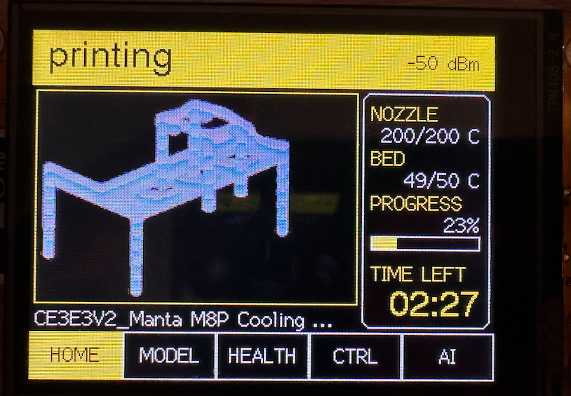
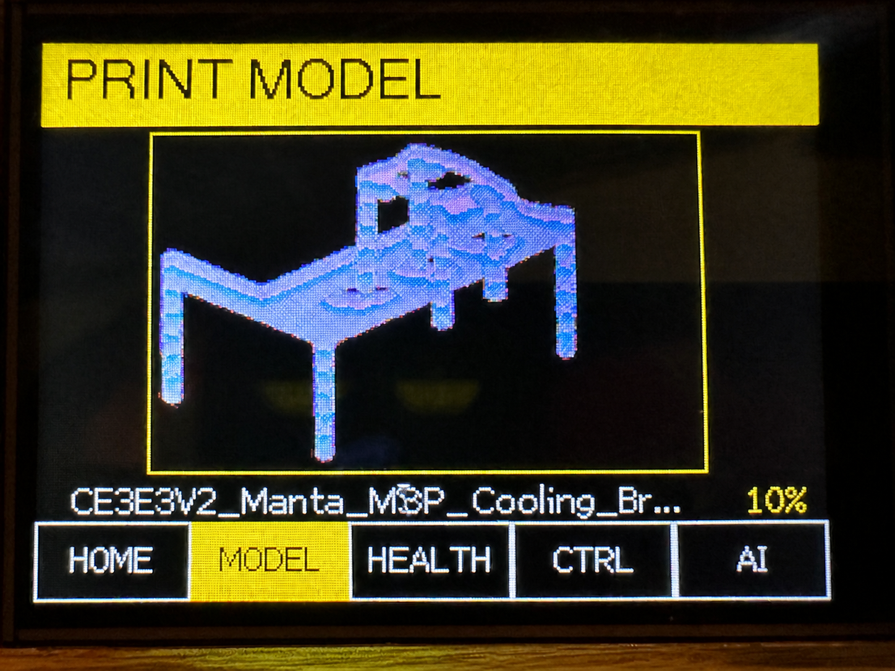

# CYD Printer Display

Touchscreen Klipper cockpit and optional cloud print-quality assistant for the
ESP32-2432S028R Cheap Yellow Display.

<p align="center">
  
  
</p>

## Features

- Flicker-free partial redraws on a black, white, red, and yellow interface
- Moonraker WebSocket updates with automatic REST fallback
- HOME page with a 70% model preview and a 30% live panel for temperatures,
  progress, and estimated time remaining
- Automatic per-print model previews generated from the active G-code on the
  CM4, with embedded slicer-thumbnail support and extrusion-path fallback
- Dedicated full model-preview page with live filename and progress
- Health page for Wi-Fi, Moonraker, BTT SFS V2.0, and BTT Eddy temperature
- TOOL page with live X/Y/Z position, homing, 1 mm jogging, Z-offset adjustment,
  and print-speed control
- EXT page with nozzle temperature, flow, pressure advance, smooth time, and
  manual 25 mm retract/extrude at 10 mm/s
- RGB status LED: white ready, yellow printing, blue paused, red alert/offline
- Automatic backlight dimming, sleep, and touch-to-wake
- Wi-Fi firmware updates from the CM4 with version checking, SHA-256 integrity
  verification, idle-only installation, and hold-to-confirm
- Optional camera analysis through a separate CM4/OpenAI gateway

The AI is advisory only. It cannot send G-code, move axes, change heaters, or
cancel a print.

## Architecture

```text
CYD ESP32 <--WebSocket/HTTP--> Moonraker
    |
    +------HTTP------> CM4 gateway ----> OpenAI Responses API (optional)
                           +----> Crowsnest snapshot
                           +----> Moonraker telemetry
                           +----> Active G-code preview (cached RGB565)
```

The OpenAI API key remains in the gateway's environment on the CM4. It is never
stored on the ESP32. See [gateway setup](gateway/README.md) for mock mode,
OpenAI configuration, automatic model previews, limits, and future local-model
support.

## Firmware configuration

Copy `include/config.example.h` to the ignored `include/config.h`, then adjust:

```cpp
#define MOONRAKER_HOST "printer.lan"
#define MOONRAKER_PORT 7125
#define MOONRAKER_API_KEY ""

#define AI_GATEWAY_HOST "printer.lan"
#define AI_GATEWAY_PORT 8787
#define AI_GATEWAY_TOKEN ""
```

Wi-Fi credentials are not compiled into the firmware. On first boot, join
`Printer-Display-Setup`, open `192.168.4.1`, and select the printer Wi-Fi.

## Touch calibration

The first boot shows two calibration targets. Touch their centers with a
stylus. Calibration is saved in ESP32 NVS. To recalibrate, hold the touchscreen
while powering or resetting the display.

The first touch after screen sleep only wakes the backlight; it never activates
a control.

## Build and upload

```sh
pio run
pio run --target upload
pio device monitor
```

The confirmed CYD serial port on this Mac is `/dev/cu.usbserial-11310`.
Building does not modify the device. Uploading replaces its firmware and starts
the touchscreen calibration flow.

## Wi-Fi firmware updates

Firmware v0.4.0 and later can update over Wi-Fi using the existing ESP32 OTA
bootloader partitions. USB remains available as the recovery path.

For a future release, update `CYD_FIRMWARE_VERSION` in
`include/firmware_version.h`, then publish the build to the CM4:

```sh
tools/publish_ota.sh
```

The script builds the firmware and atomically uploads the binary and version to
`hamed@192.168.1.138`. Override `OTA_REMOTE` or `OTA_REMOTE_DIR` when needed.

The display checks the manifest after connecting to Wi-Fi. Open **HEALTH** to
see the result. When a newer version is available and the printer is idle, hold
the update button for two seconds. The ESP downloads into the inactive OTA
partition, verifies the complete SHA-256 digest, activates it, and restarts.

## Safety model

- Status and AI features are read-only.
- Speed and flow are limited to 50-200% and 50-150%, respectively.
- Speed and flow buttons work only while Moonraker reports an active print.
- Homing, 1 mm jogging, and manual extrusion are blocked during active or
  paused prints.
- Manual extrusion is blocked below 170 C and uses the calibrated 10 mm/s
  feedrate.
- Live Z-offset adjustment uses 0.025 mm steps and is limited to +/-2 mm.
- The display does not expose `SAVE_CONFIG`, which could restart Klipper.
- OTA installation is blocked while a print is active or paused and always
  requires a continuous two-second hold.
- A downloaded firmware image is not activated unless its size and SHA-256
  digest match the CM4 manifest.
- No automatic action is taken from an AI assessment.

## Development tests

```sh
pio run
cd gateway
python3 -m venv .venv
.venv/bin/pip install -e '.[test]'
.venv/bin/pytest -q
```
