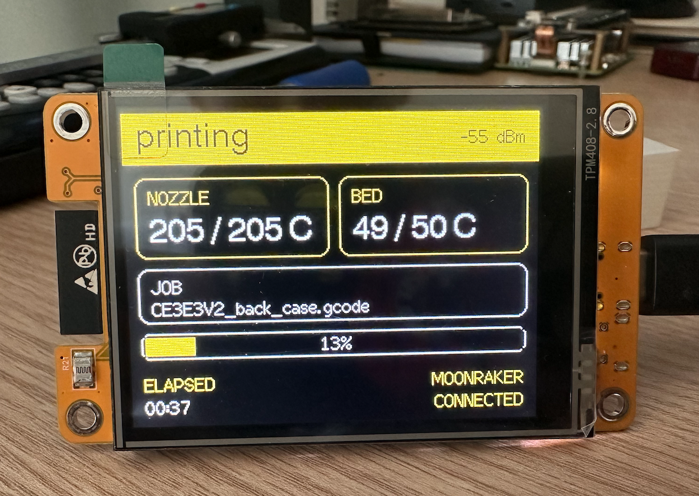

# CYD Printer Display

Touchscreen Klipper cockpit and optional cloud print-quality assistant for the
ESP32-2432S028R Cheap Yellow Display.



## Features

- Flicker-free partial redraws on a black, white, red, and yellow interface
- Moonraker WebSocket updates with automatic REST fallback
- Dashboard for state, temperatures, filename, progress, and elapsed time
- Health page for Wi-Fi, Moonraker, BTT SFS V2.0, and BTT Eddy temperature
- Touch controls for pause/resume, speed, and flow during an active print
- Two-second hold confirmation before canceling a print
- RGB status LED: white ready, yellow printing, blue paused, red alert/offline
- Automatic backlight dimming, sleep, and touch-to-wake
- Optional camera analysis through a separate CM4/OpenAI gateway

The AI is advisory only. It cannot send G-code, move axes, change heaters, or
cancel a print.

## Architecture

```text
CYD ESP32 <--WebSocket/HTTP--> Moonraker
    |
    +------HTTP------> CM4 AI gateway ----> OpenAI Responses API
                           |                     (optional)
                           +----> Crowsnest snapshot
                           +----> Moonraker telemetry
```

The OpenAI API key remains in the gateway's environment on the CM4. It is never
stored on the ESP32. See [gateway setup](gateway/README.md) for mock mode,
OpenAI configuration, limits, and future local-model support.

## Firmware configuration

Copy `include/config.example.h` to the ignored `include/config.h`, then adjust:

```cpp
#define MOONRAKER_HOST "printer.lan"
#define MOONRAKER_PORT 7125
#define MOONRAKER_API_KEY ""

#define AI_GATEWAY_HOST "printer.lan"
#define AI_GATEWAY_PORT 8787
#define AI_GATEWAY_TOKEN ""
```

Wi-Fi credentials are not compiled into the firmware. On first boot, join
`Printer-Display-Setup`, open `192.168.4.1`, and select the printer Wi-Fi.

## Touch calibration

The first boot shows two calibration targets. Touch their centers with a
stylus. Calibration is saved in ESP32 NVS. To recalibrate, hold the touchscreen
while powering or resetting the display.

The first touch after screen sleep only wakes the backlight; it never activates
a control.

## Build and upload

```sh
pio run
pio run --target upload
pio device monitor
```

The confirmed CYD serial port on this Mac is `/dev/cu.usbserial-13140`.
Building does not modify the device. Uploading replaces its firmware and starts
the touchscreen calibration flow.

## Safety model

- Status and AI features are read-only.
- Speed and flow are limited to 50-200% and 50-150%, respectively.
- Speed and flow buttons work only while Moonraker reports an active print.
- Pause/resume is available only in the matching print state.
- Cancel requires a continuous two-second hold.
- No automatic action is taken from an AI assessment.

## Development tests

```sh
pio run
cd gateway
python3 -m venv .venv
.venv/bin/pip install -e '.[test]'
.venv/bin/pytest -q
```
